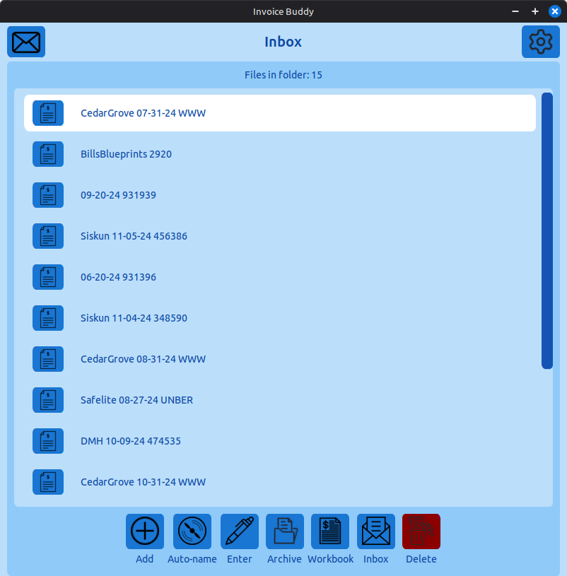
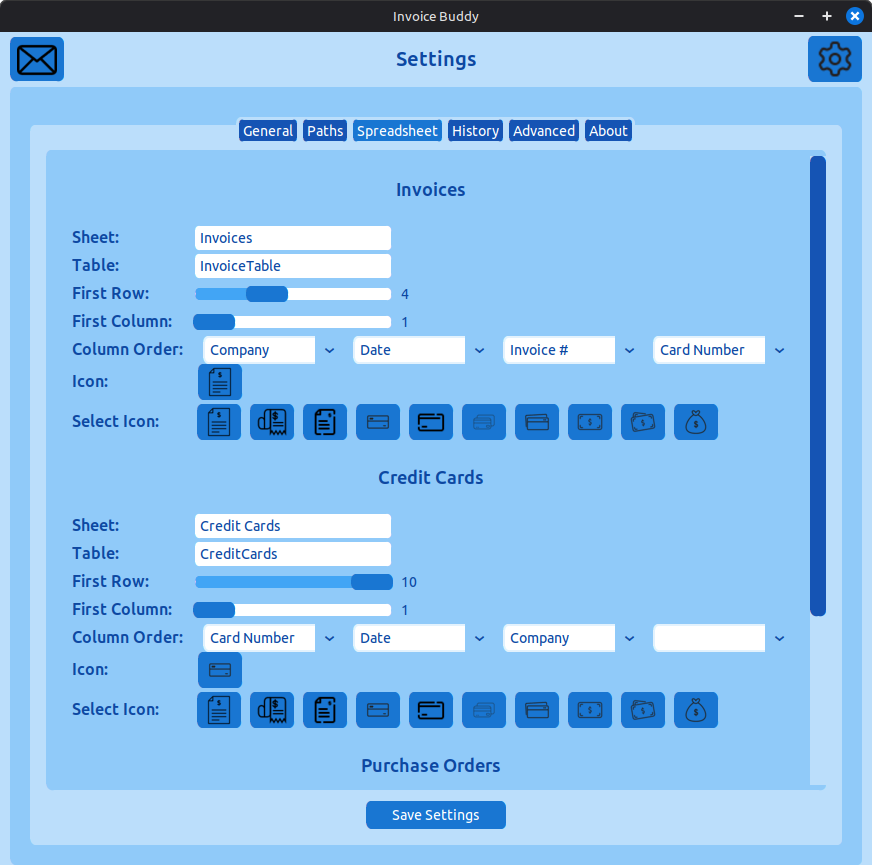

# InvoiceBuddy
Invoice Buddy is a financial management app that makes data entry easier.

## Welcome to Invoice Buddy!

Invoice Buddy is designed to make the invoice entry process easier. Instead of manually writing
each filename and then entering the necessary data into your spreadsheet, the application takes
care of it for you.

### ✨ Features

- Auto-name files based on file contents
- Easy spreadsheet entry
- Simple archiving with one button

### ⚙️ Requirements

- 4-Core CPU
- 8GB RAM recommended
- Linux Ubuntu 18.04 or later, or Windows 10/11
- 10GB+ Disk Space recommended

## 📸 View Screenshots
<details>
<summary>📸 Invoice Buddy 1</summary>



</details>

<details>
<summary>📸 Invoice Buddy 2</summary>



</details>

## 🚀 Build

### 🐧 Linux

Invoice Buddy can be built from source via Pyinstaller & bundled into an AppImage for Linux:

```
pip install -r requirements.txt

pyinstaller InvoiceBuddy-Linux.spec
```

Set AppRun inside InvoiceBuddy.AppDir as an executable file prior to building the AppImage

```
./linuxdeploy-x86_64.AppImage --appdir InvoiceBuddy.AppDir --executable InvoiceBuddy.AppDir/usr/bin/InvoiceBuddy-Linux --desktop-file InvoiceBuddy.AppDir/invoicebuddy.desktop --icon-file InvoiceBuddy.AppDir/icon.png --output appimage
```

### 🖥️ Windows

Building Invoice Buddy on Windows is simple as it only required running this command in the project root:

```
pip install -r requirements.txt

pyinstaller InvoiceBuddy-Linux.spec
```

## 🪲 Report Bugs
Report bugs via GitHub Issues.

## ⚠️ Disclaimer - Always Verify Information

Invoice Buddy scans file contents and applies that data to filenames using an algorithm. Always look over generated content to ensure its accuracy before continuing to enter data or pay invoices/receipts. The developer is not responsible for the accuracy of any generated output. The program is provided "AS-IS" with no warranties of any kind, express or implied. The use of Invoice Buddy is entirely the user's responsibility. By using Invoice Buddy, you acknowledge that any consequences arising from the use of this application are solely your own and you will not hold the developer liable for any damages or financial losses relating to its use.
