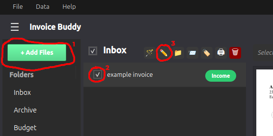

# Archive

This document describes the archive feature.

### Archive Feature

Along with auto-naming files and entering data into your spreadsheet, Invoice Buddy also suports fast archival of files for easy storage.

### How to Use

To archive files, simply add them to your view (1), select files to archive (2), and click the Archive Button (3).

Archival is typically the last thing done in the Invoice Buddy workflow after [naming files](autoname.md) and [entering them into your spreadsheet](spreadsheet.md).

Files are archived based on company name detected by the first word of the filename with whitespace as the demlimiter. Files *not* featuring supported company names as the first word will be sent to the Miscellaneous directory one level inside your configured archive path in the Paths tab of Settings.

*Up to date as of v0.3.0*
