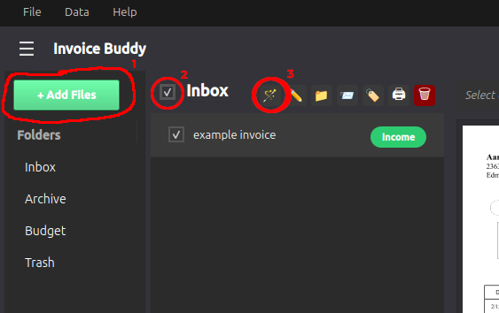
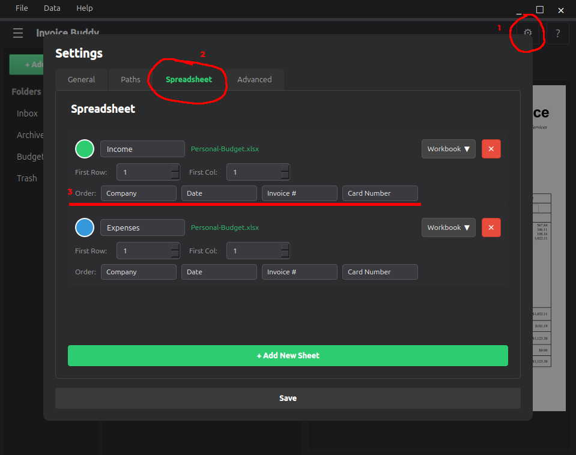

# Auto-Name

This document describes the auto-name feature, how it works, and how to configure it.

### Auto-Name Feature

Auto-Name is a feature that extracts text from PDF files and compares them to an internal database of unique strings of text commonly found in invoices or receipts from companies listed in the [companies](../companies.md) list. It then changes the filename based on collected data from selected files in coordination with your chosen format.

### How to Use
To use auto-name: first add a pdf file to the app (1), then select the file in the mailbox view (2), and finally click the auto-name icon (3).

All selected files should now have their filenames changed based on the format chosen in settings.

### Configuring Auto-Name

Auto-Name can be configured by going to settings (1), then Spreadsheet (after adding a workbook) (2), and finally the 'Order' section (3). This is where you can choose the order in which aspects of each file are written into their filenames.

### Currently Supported Data

- Company Name
- Date
- Invoice Number
- Card Number

Auto-Name is a powerful feature which can greatly speed up data entry by automating the process of naming financial files.

*Up to date as of v0.3.0*
