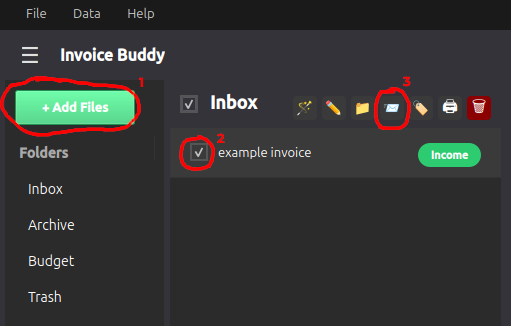
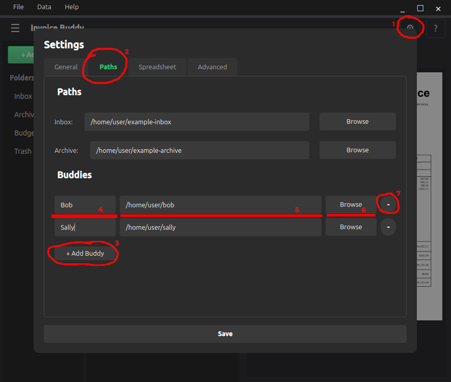

# Send to Buddies

This document describes the 'send-to-buddies' feature.

### Buddies Feature

For more complex collaborative workflows, you have the option to move files around between multiple folders available to the PC. For organizations using a shared network drive, this makes multi-step workflows seamless without needing to exit the application.

### How to Use

To send files to buddies: add files to the list view (1), select the files you wish to send (2), and select the buddies icon at the top of the view (3).

You will also see a second window appear listing your currently available buddies. From there, selecting which buddy you wish to send to will move the file.

**Information:** Sending files to buddies will move the files, meaning they will no longer be available in the current user's inbox.

### Configuring Buddies

Before sending files to buddies, you must first configure them. You can configure buddies inbox paths by going to the settings menu from the gear icon in the top right (1), then choosing the 'Paths' tab (2). From there, you will see an 'Add Buddy' button (3). Click that, then enter their name (4) and configure the path of their inbox. You can either choose to type in the path manually (5) or simply browse using the button on the right (6), which will fill in the input box automatically.

To erase an already existing buddy (or a blank row), click the delete button at the very right of the Buddy's row (7).

Finally, click save.

*Up to date as of v0.3.0*
