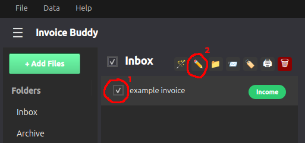
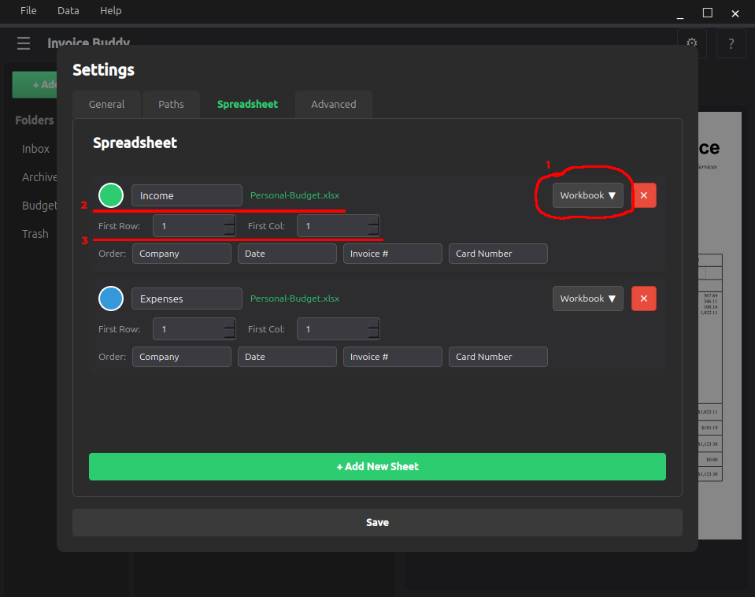
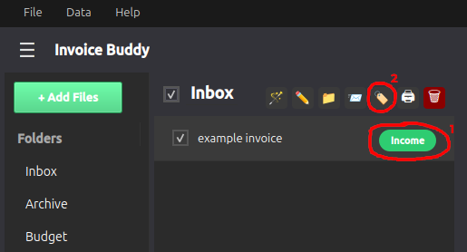

# Spreadsheet Entry

This document describes the process of entering data into a local spreadsheet via Invoice Buddy.

### Spreadsheet Feature

One of Invoice Buddy's core features is the ability to add data easily and quickly to a local spreadsheet.

### How to Use

Assuming files have already been [added and named](autoname.md), simply select files you wish to add to your spreadsheet (1) and click the enter button at the top of the mailbox view (2). That's it!

Data is added based on filenames with whitespace as the delimeter. For example, if the filename was "x y z" with first column set to 1, then column 1 would be x, column 2 would be y, and column 3 would be z.

### Configuring Spreadsheet Entry

Inside the Spreadsheet tab of the Settings menu, you can configure your workbook (1), sheet (2), and starting row/column (3). This ensures that data is entered in the proper place in the workbook.

Starting at the first configured row, Invoice Buddy searches the first five columns of each row below until it finds a row with 5 empty columns. All rows with data already entered are skipped.

**Important:** Ensure that the order selected for auto-name corresponds with the columns in your spreadsheet.

When finished, click save.

### Currently Supported Filetypes

- xlsx
- xlsm
- xltx
- xltm

### Labels

In Invoice Buddy, you have the option to label each file to separate which sheet in the workbook that file's data is entered to. This separates them based on type and can be configured in any way the user wants.

You can label files in two ways. After configuring your spreadsheet data (see the prior sections), either click the colored pill with your sheet name to cycle through all available sheets (1) or click the label icon at the top of the list view (2) and then select which sheet you want your actively selected files to be switched to.

**Information**: Labels are saved to a file's metadata and persist after moving to other folders or sending to buddies.

*Up to date as of v0.3.0*
